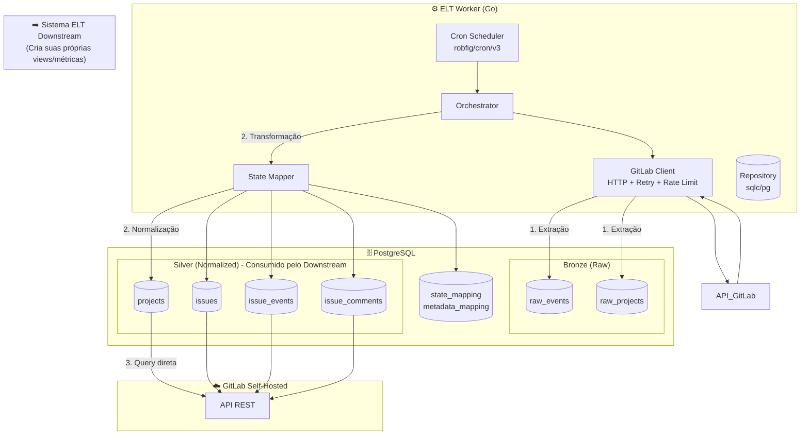

# PRD: GitLab Metrics ELT Worker

> **Document Version:** 1.0 ✅ REVISADO  
> **Last Updated:** 2025-02-27  
> **Status:** **APROVADO** - Pronto para implementação  
> **Owner:** Engineering Data Platform Team

---

## 1. Executive Summary

### Problem Statement
As equipes de desenvolvimento utilizam o GitLab de forma não padronizada para gestão de tarefas, com fluxos de trabalho baseados em labels que variam entre projetos. Isso impede a mensuração consistente de métricas de engenharia (Lead Time, Cycle Time, Throughput) necessárias para decisões de gestão sobre performance e andamento de projetos.

### Proposed Solution
Um Worker ELT (Extract-Load-Transform) em Go que:
1. **Bronze Layer**: Extrai dados brutos do GitLab self-hosted via API (resource_label_events, notes) e armazena imutavelmente em PostgreSQL (Event Sourcing)
2. **Silver Layer**: Transforma e normaliza os dados Bronze em tabelas estruturadas com estados canônicos mapeados

**Escopo do Worker:** Bronze → Silver (extração e normalização)

**Consumo:** O sistema ELT downstream acessa diretamente as tabelas Silver para criar suas próprias views e métricas analíticas (Gold Layer fica fora do escopo deste worker)

**Arquitetura:**
- **Bronze** (Raw): Dados originais da API GitLab, preservados em JSONB, imutáveis, append-only
- **Silver** (Clean): Tabelas normalizadas com mapeamento de estados e metadados estruturados, prontas para análise

### Success Criteria (KPIs)
| Métrica | Alvo | Medição |
|---------|------|---------|
| Latência de sincronização | < 20 minutos | Timestamp do evento GitLab vs timestamp de ingestão |
| Taxa de eventos processados | 100% | Eventos ingeridos / Eventos GitLab (comparando com API) |
| Mapeamento de labels | > 95% | Labels mapeadas / Total de labels únicas |
| Uptime do worker | > 99.5% | Tempo online / Tempo total (monitorado via healthcheck) |
| Tempo de processamento por batch | < 5 minutos | Para batches de até 500 eventos |

---

## 2. User Experience & Functionality

### User Personas

**1. Engineering Manager (Gestão)**
- Necessidade: Acompan métricas de produtividade da equipe
- Usa: Dashboards com Lead Time, Cycle Time, Taxa de Retrabalho
- Frequência: Diária/Semanal

**2. Data Analyst (Analistas)**
- Necessidade: Dados estruturados para análises ad-hoc
- Usa: SQL queries direto no PostgreSQL ou via API do sistema downstream
- Frequência: Sob demanda

**3. Platform Engineer (Operação)**
- Necessidade: Monitorar saúde do pipeline de dados
- Usa: Logs, métricas de sistema, alertas
- Frequência: Contínua

### User Stories

**US-001: Event Sourcing**
> Como um Data Analyst, quero acesso ao histórico bruto imutável de todas as transições de estado, para que eu possa reprocessar métricas caso as regras de negócio mudem no futuro.

**AC-001:**
- [ ] Cada mudança de label é registrada como evento individual
- [ ] Eventos nunca são atualizados ou deletados (imutabilidade)
- [ ] Payload completo da API GitLab é preservado em formato JSONB

**US-002: Mapeamento de Estados**
> Como um Engineering Manager, quero ver métricas normalizadas independentemente das nomenclaturas específicas de cada projeto, para que eu possa comparar performance entre equipes.

**AC-002:**
- [ ] Labels de fluxo são mapeados para 7 estados canônicos: BACKLOG, IN_PROGRESS, QA_REVIEW, BLOCKED, DONE, CANCELED, UNKNOWN
- [ ] Mapeamento é configurável via tabela STATE_MAPPING
- [ ] Labels novas são logadas em UNKNOWN_LABELS_LOG para auditoria

**US-003: Agendamento Inteligente**
> Como um Platform Engineer, quero que o worker respeite horários de pico e off-peak, para que não sobrecarregue a infraestrutura do GitLab.

**AC-003:**
- [ ] 08h-20h: Polling a cada 15 minutos
- [ ] 20h-08h: Polling a cada 4 horas
- [ ] Discovery de novos projetos: A cada 6 horas
- [ ] Configuração via variáveis de ambiente

**US-004: Tratamento de Edge Cases**
> Como um Data Analyst, quero que métricas sejam calculadas corretamente mesmo com comportamentos anômalos (ex: dedo nervoso, falso movimento), para que os dados reflitam a realidade.

**AC-004:**
- [ ] "Dedo Nervoso": Transições < 15 min no mesmo estado canônico são ignoradas
- [ ] "Falso Movimento": Transições entre labels do mesmo estado canônico são aglutinadas
- [ ] "Efeito Ping-Pong": Retornos de QA_REVIEW para IN_PROGRESS geram contagem de retrabalho

**US-005: Observabilidade**
> Como um Platform Engineer, quero monitorar a saúde do sistema em tempo real, para que eu possa detectar e resolver problemas proativamente.

**AC-005:**
- [ ] Logs estruturados em JSON (slog)
- [ ] Métricas de sistema: eventos processados/min, latência, erros
- [ ] Endpoint de healthcheck (HTTP)
- [ ] Alertas para falhas críticas

### Non-Goals (Fora de Escopo)

**NÃO será construído neste projeto:**
- ❌ API REST para consumo dos dados (será feito em projeto separado ELT)
- ❌ Interface gráfica/Dashboard (será feito em projeto separado)
- ❌ Processamento de dados de CI/CD (pipelines, jobs)
- ❌ Análise de código/commits (apenas issues e eventos)
- ❌ Machine Learning ou análises preditivas (apenas coleta e estruturação)
- ❌ Sistema de notificações ou alertas de negócio (apenas alertas técnicos)
- ❌ Autenticação/Autorização (assume acesso ao banco via rede interna)

---

## 3. Technical Specifications

### 3.1 Architecture Overview



### 3.2 Data Flow

**1. Discovery (a cada 6h)**
```
Worker → GET /groups/:id/projects → UPSERT into raw_projects (Bronze)
                                       ↓
                                    Normalização → UPSERT into projects (Silver)
```

**2. Sync Bronze (15min/4h) - Extração**
```
Worker → SELECT last_synced_at FROM raw_projects
       → GET /projects/:id/issues?updated_after=LAST_SYNC
       → GET /projects/:id/issues/:iid/resource_label_events
       → INSERT into raw_events (Bronze) com raw_payload JSONB
       → UPDATE raw_projects.last_synced_at
```

**3. Transformação Silver (após extração Bronze)**
```
Worker → SELECT * FROM raw_events WHERE processed = false
       → Parse payload JSONB
       → State Mapping (label → canonical_state)
       → Edge Case Detection (dedo nervoso, falso movimento)
       → UPSERT into issues (Silver)
       → INSERT into issue_events (Silver) com mapped_canonical_state
       → INSERT into issue_comments (Silver)
       → UPDATE raw_events.processed = true
```

**4. Consumo pelo Sistema Downstream**
```sql
-- Sistema ELT downstream faz queries diretas nas tabelas Silver
-- para criar suas próprias views e métricas analíticas
SELECT * FROM issue_events WHERE project_id = 123;
-- ou
SELECT * FROM issues i 
JOIN issue_events e ON e.issue_id = i.id 
WHERE i.project_id = 123;
```

**Responsabilidades:**
- **Worker ELT**: Faz Bronze → Silver (extração + transformação + normalização)
- **Sistema downstream**: Consome tabelas Silver diretamente e cria suas próprias views/métricas

### 3.3 Database Schema

**Visão Geral das Camadas:**

| Camada | Propósito | Tipo de Objeto | Consumidor |
|--------|-----------|----------------|------------|
| **Bronze** | Dados brutos da API GitLab | Tabelas imutáveis | Worker ELT (Silver) |
| **Silver** | Dados normalizados e limpos | Tabelas estruturadas | Worker ELT (Gold) + Sistema downstream |
| **Gold** | Métricas analíticas | Views | Sistema ELT downstream (API REST) |

---

#### Bronze Layer (Raw Data)

Dados originais da API GitLab, preservados **exatamente como recebidos**, sem transformação. Append-only, imutáveis.

**raw_events** (TABELA BRONZE PRINCIPAL)
| Field | Type | Description |
|-------|------|-------------|
| id | BIGSERIAL PK | ID interno |
| gitlab_event_id | BIGINT | ID do evento no GitLab |
| project_id | INTEGER | ID do projeto no GitLab |
| issue_iid | INTEGER | Número da issue visível |
| event_type | VARCHAR(50) | Tipo: label_event, note, issue_update |
| raw_payload | JSONB | **Payload COMPLETO da API GitLab** |
| fetched_at | TIMESTAMPTZ | Quando foi extraído |
| created_at | TIMESTAMPTZ | Metadado |

**raw_projects** (Cache de metadados de projetos)
| Field | Type | Description |
|-------|------|-------------|
| id | INTEGER PK | ID do projeto no GitLab |
| name | VARCHAR(255) | Nome legível |
| path | VARCHAR(255) | Namespace/path |
| last_synced_at | TIMESTAMPTZ | Cursor de sincronização |
| raw_metadata | JSONB | Payload completo do projeto |
| created_at | TIMESTAMPTZ | Metadado |
| updated_at | TIMESTAMPTZ | Metadado |

---

#### Silver Layer (Clean/Normalized)

Dados processados, normalizados e estruturados. Estados mapeados, duplicatas removidas, tipos convertidos.

**projects** (Normalizado a partir de raw_projects)
| Field | Type | Description |
|-------|------|-------------|
| id | INTEGER PK | ID do projeto no GitLab |
| name | VARCHAR(255) | Nome legível |
| path | VARCHAR(255) | Namespace/path |
| last_synced_at | TIMESTAMPTZ | Cursor de sincronização |
| created_at | TIMESTAMPTZ | Metadado |
| updated_at | TIMESTAMPTZ | Metadado |

**issues** (Entidade principal normalizada)
| Field | Type | Description |
|-------|------|-------------|
| id | SERIAL PK | ID interno |
| gitlab_issue_id | INTEGER | ID global GitLab |
| project_id | INTEGER FK | → projects |
| iid | INTEGER | Número visível (#215) |
| title | VARCHAR(500) | Título da issue |
| current_canonical_state | VARCHAR(50) | Cache do último estado mapeado |
| metadata_labels | JSONB | Labels categóricas (Bug, Correção, etc.) |
| assignees | JSONB | JSON array de assignees |
| gitlab_created_at | TIMESTAMPTZ | Data criação original |
| created_at | TIMESTAMPTZ | Metadado |
| updated_at | TIMESTAMPTZ | Metadado |

**issue_events** (Eventos limpos e mapeados)
| Field | Type | Description |
|-------|------|-------------|
| id | BIGSERIAL PK | ID interno |
| gitlab_event_id | BIGINT | ID do evento no GitLab |
| issue_id | INTEGER FK | → issues |
| project_id | INTEGER | Denormalizado para performance |
| issue_iid | INTEGER | Denormalizado |
| author_name | VARCHAR(255) | Quem fez a ação |
| raw_label_added | VARCHAR(255) | Label adicionada (texto original) |
| raw_label_removed | VARCHAR(255) | Label removida (texto original) |
| **mapped_canonical_state** | VARCHAR(50) | **Estado canônico mapeado** |
| event_timestamp | TIMESTAMPTZ | Momento do evento no GitLab |
| is_noise | BOOLEAN | Se é "dedo nervoso" (ignorado nas métricas) |
| cycle_count | INTEGER | Contador de ciclos de retrabalho |
| created_at | TIMESTAMPTZ | Metadado |

**issue_comments** (Comentários estruturados)
| Field | Type | Description |
|-------|------|-------------|
| id | BIGSERIAL PK | ID interno |
| gitlab_note_id | BIGINT | ID do note no GitLab |
| issue_id | INTEGER FK | → issues |
| author_name | VARCHAR(255) | Autor do comentário |
| body | TEXT | Conteúdo |
| comment_timestamp | TIMESTAMPTZ | Data do comentário |
| created_at | TIMESTAMPTZ | Metadado |

---

#### Config Layer (Referência)

**state_mapping**
| Field | Type | Description |
|-------|------|-------------|
| id | SERIAL PK | - |
| gitlab_label_name | VARCHAR(255) UNIQUE | Label original |
| canonical_state | VARCHAR(50) | Estado canônico mapeado |
| description | TEXT | Documentação |
| created_at | TIMESTAMPTZ | - |
| updated_at | TIMESTAMPTZ | - |

**metadata_mapping**
| Field | Type | Description |
|-------|------|-------------|
| id | SERIAL PK | - |
| gitlab_label_name | VARCHAR(255) UNIQUE | Label original |
| metadata_key | VARCHAR(100) | Chave categórica (tipo, prioridade) |
| created_at | TIMESTAMPTZ | - |

**unknown_labels_log**
| Field | Type | Description |
|-------|------|-------------|
| id | SERIAL PK | - |
| label_name | VARCHAR(255) | Label não mapeada |
| occurrence_count | INTEGER | Contador |
| last_seen_at | TIMESTAMPTZ | Última ocorrência |
| first_seen_at | TIMESTAMPTZ | Primeira ocorrência |

---

### 3.4 Componentes do Worker

#### 1. Scheduler (robfig/cron/v3)
```go
type Scheduler struct {
    cron *cron.Cron
    jobs map[string]cron.EntryID
}

func (s *Scheduler) RegisterSyncJob(schedule string, jobFunc func()) error
func (s *Scheduler) RegisterDiscoveryJob(schedule string, jobFunc func()) error
```

#### 2. GitLab Client
```go
type GitLabClient interface {
    // Rate limiting: max 10 req/s com backoff exponencial
    ListProjects(ctx context.Context, groupID int) ([]Project, error)
    ListIssues(ctx context.Context, projectID int, updatedAfter time.Time) ([]Issue, error)
    ListLabelEvents(ctx context.Context, projectID, issueIID int) ([]LabelEvent, error)
    ListNotes(ctx context.Context, projectID, issueIID int) ([]Note, error)
}
```

#### 3. State Mapper
```go
type StateMapper interface {
    // Carrega mappings do banco em cache no startup
    LoadMappings(ctx context.Context) error
    
    // Retorna estado canônico e tipo (STATE/METADATA/UNKNOWN)
    MapLabel(label string) (canonicalState string, labelType LabelType)
    
    // Loga label desconhecida
    LogUnknownLabel(ctx context.Context, label string) error
}
```

#### 4. Repository (sqlc)
```go
type Repository interface {
    // Projects
    UpsertProject(ctx context.Context, arg UpsertProjectParams) (Project, error)
    ListActiveProjects(ctx context.Context) ([]Project, error)
    UpdateLastSyncedAt(ctx context.Context, arg UpdateLastSyncedAtParams) error
    
    // Issues
    UpsertIssue(ctx context.Context, arg UpsertIssueParams) (Issue, error)
    
    // Events
    InsertIssueEvent(ctx context.Context, arg InsertIssueEventParams) (IssueEvent, error)
    BulkInsertIssueEvents(ctx context.Context, arg []InsertIssueEventParams) error
    
    // Comments
    InsertIssueComment(ctx context.Context, arg InsertIssueCommentParams) (IssueComment, error)
    
    // Config
    ListStateMappings(ctx context.Context) ([]StateMapping, error)
    ListMetadataMappings(ctx context.Context) ([]MetadataMapping, error)
    UpsertUnknownLabel(ctx context.Context, arg UpsertUnknownLabelParams) error
}
```

### 3.5 Integration Points

| Sistema | Tipo | Endpoint/Detalhes |
|---------|------|-------------------|
| GitLab Self-Hosted | API REST | Base URL + Private Token |
| PostgreSQL | Database | pgx/v5 connection pool |
| Prometheus (opcional) | Métricas | /metrics endpoint |
| Healthcheck | HTTP | :8080/health (200 OK) |

### 3.6 Security & Privacy

**Dados Sensíveis:**
- GitLab Token: Armazenado em variável de ambiente (nunca no código)
- Dados de issues: PII mínimo (apenas author_name, que é username público)

**Medidas:**
- Conexão PostgreSQL com SSL (sslmode=require em produção)
- GitLab Token com permissão mínima (read_api apenas)
- Logs não contêm tokens ou dados sensíveis
- .env no .gitignore

**Compliance:**
- LGPD: Dados são de uso interno corporativo, sem dados pessoais sensíveis
- Retenção: Definir política de purga de dados antigos (sugestão: 2 anos para raw, 5 anos para métricas agregadas)

---

## 4. Implementation Plan (Arquitetura Bronze/Silver/Gold)

### Phase 1: Foundation + Bronze Layer (Semanas 1-2)
**Objetivo:** Infrastructure e extração de dados brutos (Bronze)
- [ ] Setup projeto Go (módulo, estrutura)
- [ ] PostgreSQL + Docker Compose local
- [ ] **Bronze Layer**: Tabelas raw (raw_events, raw_projects)
- [ ] Config loading + validação
- [ ] Logging estruturado (slog)
- [ ] Healthcheck endpoint
- [ ] Makefile e DX

**Output:** Worker consegue extrair e armazenar dados brutos do GitLab

### Phase 2: Bronze → Silver Transformation (Semanas 3-4)
**Objetivo:** Transformação e normalização (Bronze → Silver)
- [ ] GitLab Client com retry e rate limiting
- [ ] Discovery service (Bronze: raw_projects → Silver: projects)
- [ ] **Sync Bronze**: Extração incremental para raw_events
- [ ] **Transformação Silver**: Normalização de raw_events → issues/issue_events
- [ ] State Mapper engine (labels → estados canônicos)
- [ ] Agendamento inteligente (cron)
- [ ] Graceful shutdown

**Output:** Dados normalizados em tabelas Silver com estados mapeados

### Phase 3: Silver Refinement (Semanas 5-6)
**Objetivo:** Refinar dados Silver e preparar para consumo
- [ ] Tabelas de config (state_mapping, metadata_mapping)
- [ ] State Mapper engine (labels → estados canônicos)
- [ ] Tratamento de edge cases (dedo nervoso, falso movimento, ping-pong)
- [ ] Unknown labels logging
- [ ] Dados Silver prontos: issues, issue_events, issue_comments normalizados

**Output:** Tabelas Silver limpas e normalizadas, prontas para o sistema downstream criar suas próprias análises

**Nota:** Views analíticas (Lead Time, Cycle Time, etc.) ficam fora do escopo deste worker. O sistema ELT downstream acessa as tabelas Silver diretamente.

### Phase 4: Observability & Hardening (Semanas 7-8)
**Objetivo:** Monitoramento e qualidade
- [ ] Métricas Prometheus (eventos/min, latência, erros)
- [ ] Dashboards: Bronze ingestion rate, Silver transform rate
- [ ] Alertas (falhas, unknown labels, latência)
- [ ] Testes de integração (E2E: GitLab → Bronze → Silver)
- [ ] Documentação técnica
- [ ] Dockerfile multi-stage
- [ ] Deploy em staging

**Output:** Sistema monitorável e testado em staging

### Phase 5: Production (Semana 9+)
**Objetivo:** Deploy e operação
- [ ] Deploy em produção
- [ ] Backfill de dados históricos (Bronze + Silver)
- [ ] Monitoramento das camadas Bronze e Silver
- [ ] Documentação de operação
- [ ] Treinamento da equipe
- [ ] Handoff para equipe de Data Platform

**Output:** Sistema em produção com dados históricos (Bronze + Silver) e equipe treinada

---

## 5. Risks & Mitigations

| Risco | Probabilidade | Impacto | Mitigação |
|-------|--------------|---------|-----------|
| GitLab API indisponível | Média | Alto | Retry com backoff exponencial; alertar após N falhas |
| Rate limiting | Alta | Médio | Implementar throttling (max 10 req/s); usar updated_after para batches pequenos |
| Crescimento inesperado de volume | Baixa | Alto | Arquitetura horizontal (múltiplos workers por projeto); particionamento de tabelas |
| Labels novas não mapeadas | Alta | Médio | Unknown labels log; alerta diário para mapeamentos pendentes; dashboard de cobertura |
| Mudanças na API GitLab | Baixa | Alto | Abstrair GitLab client; testes de integração; monitorar changelogs |
| Perda de dados (eventos perdidos) | Baixa | Alto | Cursor de sincronização confiável; validação cruzada com counts da API |

---

## 6. Open Questions

1. **Particionamento:** Devemos particionar issue_events por projeto_id ou por data desde o início?
2. **Backfill:** Precisamos carregar dados históricos? Se sim, quantos meses?
3. **Multiplos Workers:** Um worker processa todos os projetos ou dividimos por instância?
4. **Dead Letter Queue:** Eventos que falham devem ir para DLQ ou apenas logar erro?
5. **API Rate Limit:** Qual o rate limit exato do GitLab self-hosted?

---

## 7. Appendix

### A. Estados Canônicos - Mapeamento Sugerido

| Label GitLab Real | Estado Canônico |
|-------------------|-----------------|
| Backlog, Não iniciado, To Do | BACKLOG |
| Em dev, Em Andamento, Doing, Development | IN_PROGRESS |
| Teste HOM, Teste Prod, Correção, Não Publicado, QA | QA_REVIEW |
| Bloqueado, Blocked, Impedido | BLOCKED |
| Concluído, Done, Closed, Finalizado | DONE |
| Cancelado, Cancelled, Won't Fix | CANCELED |
| *Qualquer outra* | UNKNOWN |

### B. Métricas Possíveis (Para o Sistema Downstream Calcular)

Com base nos dados Silver estruturados, o sistema downstream pode calcular:

1. **Lead Time:** Tempo total (BACKLOG → DONE)
2. **Cycle Time:** Tempo de trabalho ativo (IN_PROGRESS + QA_REVIEW)
3. **Wait Time:** Tempo em BACKLOG + BLOCKED
4. **Throughput:** Issues DONE por semana
5. **WIP (Work In Progress):** Issues em IN_PROGRESS ou QA_REVIEW
6. **Taxa de Retrabalho:** % de issues que voltaram de QA_REVIEW para IN_PROGRESS
7. **Trabalho Fantasma:** % de issues DONE que nunca passaram por IN_PROGRESS
8. **Blocked Time:** Tempo total em BLOCKED
9. **Ciclos de Vida:** Quantidade de transições IN_PROGRESS ↔ QA_REVIEW

**Nota:** Estas métricas são exemplos do que pode ser calculado. O sistema ELT downstream criará suas próprias views/queries baseadas nas tabelas Silver (`issues`, `issue_events`, `issue_comments`).

### C. Checklist de Deploy

- [ ] Variáveis de ambiente configuradas
- [ ] Migrations aplicadas
- [ ] State mappings populados (seed data)
- [ ] Healthcheck respondendo
- [ ] Métricas Prometheus acessíveis
- [ ] Alertas configurados
- [ ] Documentação atualizada
- [ ] Runbook de troubleshooting
